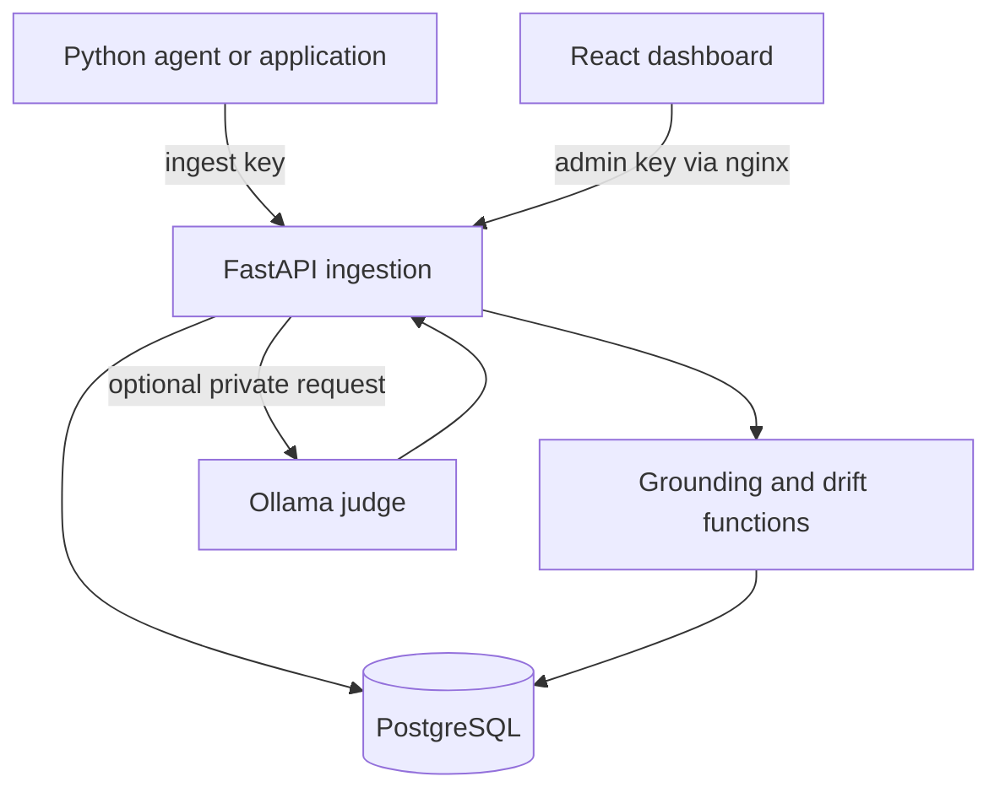

# Architecture

## Storage

`traces`: globally unique producer UUID, project, name, model, status, elapsed latency and token counts; prompt/response/contexts/spans/tools and attributes in JSONB. Traces are immutable; duplicate IDs return 409.

`logs`: server timestamp, severity, message, JSONB attributes and optional trace reference. PostgreSQL English full-text index supports word search, not arbitrary regex/substrings.

`metrics`: numeric gauge samples with name, unit and JSONB attributes. UI shows count/mean/min/max by metric/unit over the selected window. No counter resets or histogram semantics are inferred.

`evaluations`: stored method, result, timestamp and optional trace; drift results reference baseline identity inside JSONB.

`baselines`: immutable named samples scoped by project/kind. Give changed references a new versioned name. Vector arrays live in JSONB; no approximate nearest-neighbor index is required for centroid calculations, so pgvector is not necessary for this release.

`schema_version`: initial schema marker. `schema.sql` is idempotent for fresh v1 installs; future releases need reviewed migrations.

All timestamps are database ingestion timestamps in UTC, displayed in browser local time. Client event-time ingestion and backfill are not implemented. Span data contains hierarchy and durations, not absolute start offsets; the UI does not pretend to show a concurrency waterfall.

## Execution

The Python service validates bounded payloads, performs basic redaction, and commits one record per request. Authenticated admin routes calculate aggregates in PostgreSQL. Judge calls execute synchronously outside a database transaction with a 120-second timeout. Failed judge calls return errors rather than fabricated evaluation results.

Deploy API and database on a private network. Browser requests use the web container's same-origin reverse proxy. No permissive CORS is enabled. Ollama host configuration is server-owned; API clients cannot supply arbitrary outbound judge URLs.

## Scale limits

Request bodies: 2 MB. Trace spans: 200. Contexts: 30. Baselines: 500 samples, maximum embedding dimension 4096, bounded also by request size. Trace/log/evaluation lists are paginated. The baseline list is unpaginated and intended for small workspaces. Start with modest telemetry volume; benchmark before expanding. Add batched ingestion, durable queues, partitions, object storage and asynchronous evaluation workers as workload requires them.
